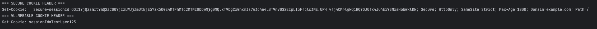

# Sprawozdanie: Secure Cookie Flag

---

## Cel ćwiczenia

Celem ćwiczenia było zapoznanie się z jedną z podatności z listy OWASP — Secure Cookie Flag.  
Zadanie polegało na stworzeniu dwóch wersji klasy w języku Java:

1. Podatnej (Vulnerable) – brak flag bezpieczeństwa w ciasteczku sesji,
2. Poprawionej (Secure) – ciasteczko zawiera wszystkie kluczowe flagi (`Secure`, `HttpOnly`, `SameSite`),  
   a także dodatkowe mechanizmy bezpieczeństwa (walidacja, HMAC, TTL, logowanie).

---

## Opis podatności

Podatność Secure Cookie Flag występuje, gdy aplikacja ustawia ciasteczko sesyjne bez flag:
- `Secure` – wymusza przesyłanie ciasteczka tylko przez HTTPS,
- `HttpOnly` – blokuje dostęp do ciasteczka przez JavaScript,
- `SameSite` – ogranicza wysyłanie ciasteczka między domenami (ochrona przed CSRF).


---

## Implementacja

### Wersja podatna – `SecureCookieFlag_Ledwon.java`

```java
public class SecureCookieFlag_Ledwon implements VulnerabilityLogic {

    @Override
    public String process(String userInput, EnvironmentContext context) throws Exception {
        String sessionId = (userInput != null && !userInput.isEmpty()) ? userInput : "abc123";

        return "Set-Cookie: sessionId=" + sessionId;
    }
}
```
Wersja podatna nie dodaje żadnych flag bezpieczeństwa. W efekcie ciasteczko:
- może zostać przesłane po HTTP,
- jest dostępne z poziomu JavaScript (document.cookie),
- może być wykorzystane w ataku CSRF.

### Wersja poprawiona – `Fixed_SecureCookieFlag_Ledwon.java`

Zastosowano:
- losowe generowanie sessionId (SecureRandom, UUID, timestamp)
- podpis HMAC (HmacSHA256) w celu weryfikacji integralności
- dodanie flag: Secure, HttpOnly, SameSite=Strict
- ograniczenie domeny (Domain=), ścieżki (Path=/) i czasu życia (Max-Age=1800)
- prefiks __Secure- w środowisku produkcyjnym

Dodatkowa klasa EnvironmentContext przekazuje dane środowiskowe (klucz HMAC, domenę, IP, czas życia sesji).

---

## Wyniki testów



- flagi Secure, Httonly, SameSite poprawnie ustawione
- ograniczenie do domeny example.com
- maksymalny czas życia sesji 30 minut

---

## Wnioski
Implementacja flag bezpieczeństwa w ciasteczkach sesyjnych znacząco podnosi poziom bezpieczeństwa aplikacji webowych.  
Brak tych flag naraża aplikację na różne ataki, takie jak przechwytywanie ciasteczek czy ataki CSRF. 
Dodanie kilku linii kodu pozwala na skuteczną ochronę przed tymi zagrożeniami, nie mając przy tym znacząco wpłynąć na wydajność aplikacji.